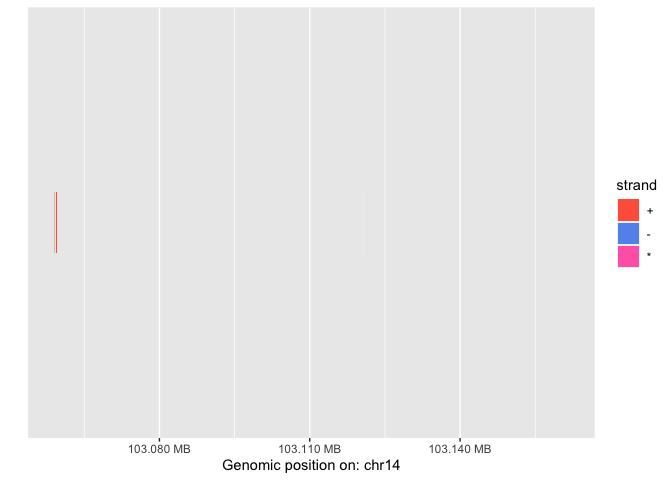
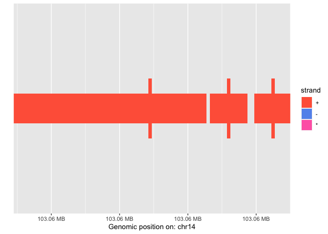
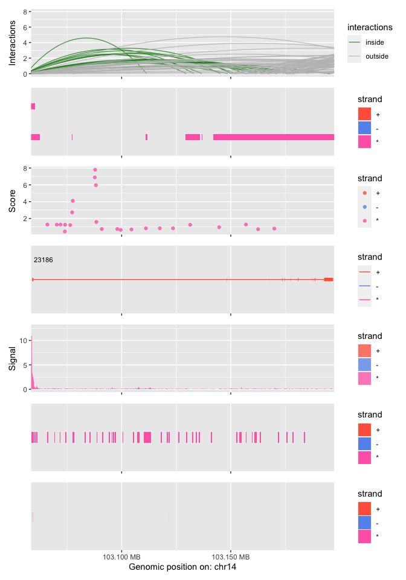
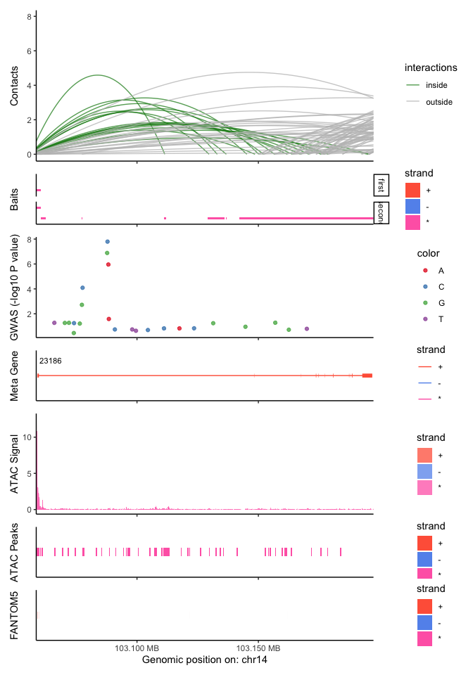
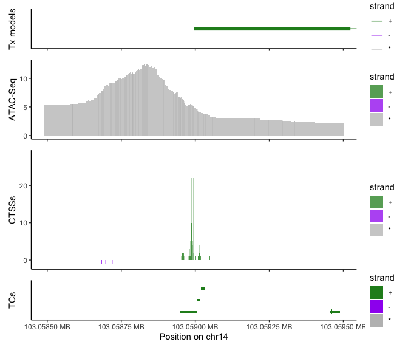
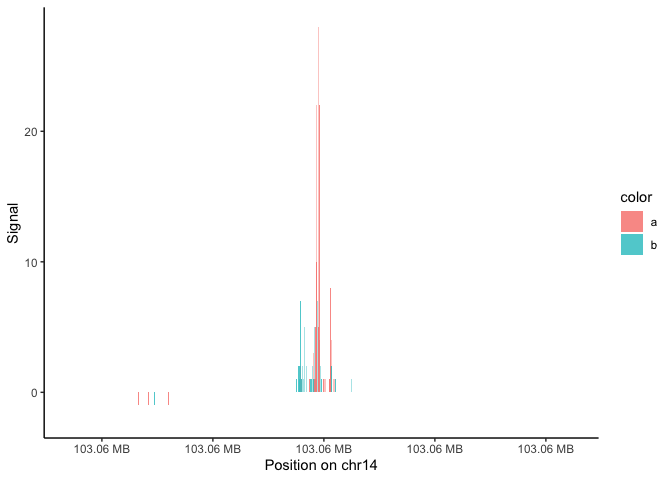

<!-- README.md is generated from README.Rmd. Please edit that file -->

# tidyGenomeBrowser

<!-- badges: start -->

<!-- badges: end -->

`tidyGenomeBrowser` makes it easy to generate genome browser figures via
R/Bioconductor. It acts as a thin layer of glue between the elaborate
and efficient S4-system of Bioconductor and the widely used S3-system of
the tidyverse.

Genome-browser images are simple, in the sense that they always share
the same X-axis, specified by seqnames/start/end/strand information.
`tidyGenomeBrowser` will take Bioconductor S4-objects such as `GRanges`,
`GPos`, `GRangesList` and `GInteractions` and automatically process them
into tidy `data.frame` object. These `data.frame` objects can then
either be returned for further manipulations, or plotted directly via
ggplot2.

`tidyGenomeBrowser` tries to use sensible defaults, making it very quick
and well suited for interactive use. However, as all plotting data is
returned as `data.frame` or `ggplot` objects, it’s easy to manipulate
them for publication grade figures.

`tidyGenomeBrowser` functions take almost no arguments, but reacts to
some common meta-columns used in Bioconductor (e.g. `score`, `pos`,
`thick`) or package-wide settings.

## Installation

`tidyGenomeBrowser` is currently only available on GitHub:

``` r
devtools::install_github("MalteThodberg/tidyGenomeBrowser")
```

## Overview

`tidyGenomeBrowser` contains 4 major functions, each capable oof
plotting a specific type of data:

  - browseIntervals: Plots ranges or intervals, e.g. BED-like data, from
    a `GRanges`.
  - browseSignal: Plots a genome-wide signal, e.g. BigWig/bedGraph-like
    data, from a `GRanges`.
  - browserInteractions: Plots genomic interactions or contacts,
    e.g. BEDPE-like data, from a `GInteractions`.
  - browsePositions: Plots single-bp positions, e.g. VCF-like data, from
    a `GPos`

## Quick start

### Required packages

Packages needed for this example:

``` r
library(tidyGenomeBrowser)
library(TxDb.Hsapiens.UCSC.hg19.knownGene)
library(magrittr)
library(tidyverse)
```

#### Plotting a single track

The simplest case is just plotting data from a single object, called a
single track:

``` r
CAGE_TCs
#> GRanges object with 6 ranges and 2 metadata columns:
#>       seqnames              ranges strand |     score     thick
#>          <Rle>           <IRanges>  <Rle> | <numeric> <IRanges>
#>   [1]    chr14 103058949-103059005      + |    145421 103058989
#>   [2]    chr14 103059007-103059017      + |      5014 103059012
#>   [3]    chr14 103059020-103059030      + |        55 103059025
#>   [4]    chr14 103059456-103059488      + |       809 103059461
#>   [5]    chr14 103121472-103121475      + |       800 103121474
#>   [6]    chr14 103161724-103161726      + |        43 103161726
#>   -------
#>   seqinfo: 298 sequences from hg19 genome

browseIntervals(CAGE_TCs)
```



The function will automatically set a proper plotting window in this
case:

``` r
browseIntervals(CAGE_TCs[1:3])
```



#### Browsing multiple types of genomic data

Most often the goal is to plot multiple tracks together. This is done by
setting up a plot region of interest, and then building a track for each
data type.

Set up plot region around a gene of interest:

``` r
# Reference gene and transcript models
txdb <- TxDb.Hsapiens.UCSC.hg19.knownGene

# Extract location of genes
gene_models <- genes(txdb)
#>   403 genes were dropped because they have exons located on both strands
#>   of the same reference sequence or on more than one reference sequence,
#>   so cannot be represented by a single genomic range.
#>   Use 'single.strand.genes.only=FALSE' to get all the genes in a
#>   GRangesList object, or use suppressMessages() to suppress this message.
RCOR1 <- gene_models["23186"]

# Plotting window: 500 bp around AKAP2
gene_window <- RCOR1 + 500

# Window around promoter for second examples
promoter_window <- promoters(RCOR1, upstream=500, downstream=500)
```

Extract transcript models:

``` r
tx_models <- exonsBy(txdb, by="tx", use.names=TRUE)
meta_models <- exonsBy(txdb, by="gene")
```

Build individual tracks:

``` r
# GWAS
gwas_track <- GWAS %>%
    transform(score=-log10(P)) %>%
    browsePositions(region=gene_window)
#> Plotting region size: 138918
#> Features within region: 24
#> Found scores...

# Meta-genes
meta_track <- meta_models %>%
    browseTranscripts(region=gene_window)
#> Plotting region size: 138918
#> Features within region: 1

# Open chromatin
signal_track <- ATAC_signal %>% 
    browseSignal(region=gene_window)
#> Plotting region size: 138918
#> Features within region: 3613
peak_track <- ATAC_peaks %>% 
    browseIntervals(region=gene_window)
#> Plotting region size: 138918
#> Features within region: 49

# Transcription Start Sites
tc_track <- CAGE_TCs %>% 
    browseIntervals(region=gene_window)
#> Plotting region size: 138918
#> Features within region: 6
#> Found thickStart/End...

# Interactions
contacts_track <- PCHiC %>%
    browseInteractions(region=gene_window)
#> Plotting region size: 138918
#> Interactions within region: 97
#> Found interaction score: Setting arch heights to score
#> Found scores as arch heights...

# Baits
baits_track <- PCHiC %>%
    anchors %>%
    GRangesList %>% 
    unique %>%
    browseIntervals(region=gene_window)
#> Plotting region size: 138918
#> Features within region: 27
```

Plot everything together:

``` r
list(contacts_track,
     baits_track,
     gwas_track,
     meta_track,
     signal_track,
     peak_track,
     tc_track) %>%
    browseStack()
#> Warning: Removed 12 rows containing missing values (geom_text_repel).
```



### Customizing plots

As all returned object are ggplots, it’s easy to customize:

``` r
theme_set(theme_classic())

# Color GWAS track by SNP
gwas_track2 <- GWAS %>%
    transform(score=-log10(P),
              color=A1) %>%
    browsePositions(region=gene_window) +
    scale_color_brewer(palette="Set1")
#> Plotting region size: 138918
#> Features within region: 24
#> Found custom colors...
#> Found scores...

# New customized plot
list(contacts_track + ylab("Contacts"),
     baits_track + ylab("Baits"),
     gwas_track2 + ylab("GWAS (-log10 P value)"),
     meta_track + ylab("Meta Gene"),
     signal_track + ylab("ATAC Signal"),
     peak_track + ylab("ATAC Peaks"),
     tc_track + ylab("FANTOM5")) %>%
    browseStack(heights=c(3, 1, 2, 1, 2, 1, 1))
#> Warning: Removed 12 rows containing missing values (geom_text_repel).
```



Package-wide settings can also be used (see `?tidyGenomeBrowser` for a
complete list):

``` r
# Change strand colors
options(tidyGenomeBrowser.strand=c(`+`="forestgreen",
                                   `-`="purple",
                                   `*`="grey"))

# Change x label:
options(tidyGenomeBrowser.prefix="Position on ")

# Transcripts
options(tidyGenomeBrowser.name=FALSE)
tx_track <- meta_models %>%
    browseTranscripts(region=promoter_window)
#> Plotting region size: 1000
#> Features within region: 1
#> Skipping adding transcript names...

# Open chromatin
signal_track <- ATAC_signal %>% 
    browseSignal(region=promoter_window)
#> Plotting region size: 1000
#> Features within region: 363

# More wiggle room when stacking
options(tidyGenomeBrowser.wiggle=100)
tc_track <- CAGE_TCs %>% 
    browseIntervals(region=promoter_window)
#> Plotting region size: 1000
#> Features within region: 4
#> Found thickStart/End...
ctss_track <- CAGE_CTSSs %>% 
    browseSignal(region=promoter_window)
#> Plotting region size: 1000
#> Features within region: 48
#> Flipping signal on minus strand...
#> Found single-bp ranges...

# All tracks together
list(tx_track + ylab("Tx models"),
     signal_track + ylab("ATAC-Seq"),
     ctss_track + ylab("CTSSs"),
     tc_track + ylab("TCs")) %>%
    browseStack(heights=c(1, 2, 3, 1))
```



### Intercepting plotting data

All plotting functions can be intercepted, e.g. the raw `data.frame` can
be returned rather than plotted:

``` r
# Intercept
ctss_data <- CAGE_CTSSs %>% 
    browseSignal(plot=FALSE)
#> Plotting region size: 137511
#> Features within region: 276
#> Flipping signal on minus strand...

# Look at the data
head(ctss_data)
#>   seqnames       pos strand score
#> 1    chr14 103058951      +     1
#> 2    chr14 103058954      +     2
#> 3    chr14 103058955      +     1
#> 4    chr14 103058956      +     2
#> 5    chr14 103058957      +     2
#> 6    chr14 103058958      +     7

# Plotting window stored as attribute?
#attributes(ctss_data)
```

After manipulation, data can be replotted:

``` r
ctss_data %>%
    mutate(strand == "*",
           color=sample(x=letters[1:2], size=n(), replace=TRUE)) %>%
    browseSignal(region=promoter_window)
#> Found single-bp ranges...
```



Note that no checks on the data is performed at this stage: This makes
tidyGenomeBrowser very hackable, but you can also potentially screw up\!

## Cookbook

Below are some common recipes and tips & tricks for manipulating
ggplots.

### Adding highlights

TBA

### Adding common legend

TBA
